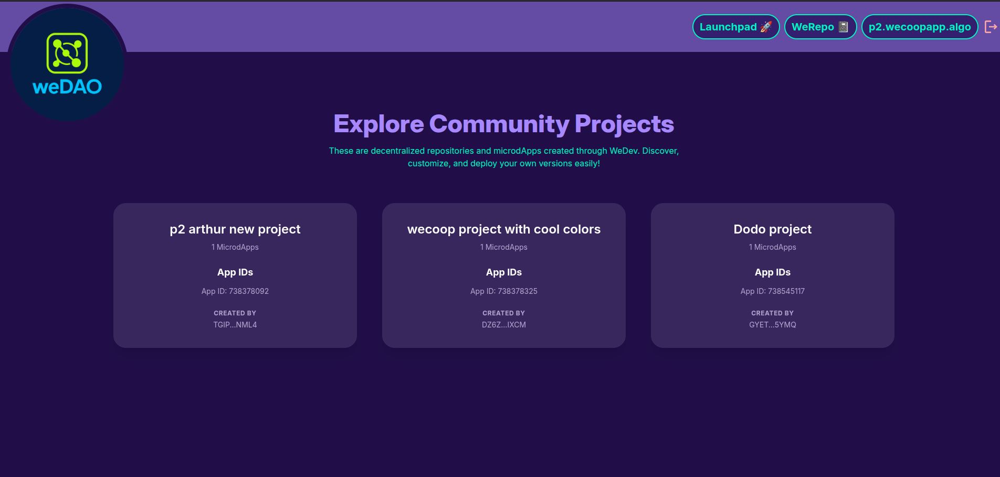

# 🛠️ weDev — Launch Web3 Projects with Zero Friction

**weDev** is an open-source toolkit that lets anyone launch fully customizable microdApps on the Algorand blockchain — no backend, no smart contract experience needed.

Built during the Castell D’Code Retreat with support from the Algorand Foundation and powered by AlgoKit 3.0, weDev enables creators to deploy DAOs, staking modules, and more in just a few clicks. Everything runs through a decentralized registry contract — making the experience fully trustless and developer-free by default.

Led by **Arthur Rabelo** (Web3 Engineer) and **Kieran Nelson** (Senior Web3 Engineer), the project combines deep blockchain engineering with clean and intuitive user experience.

---

## 🚀 What You Can Do with weDev

- Launch projects in minutes with a simple form: enter your project name, pick theme colors, and select which tools you want.
- Instantly deploy modular microdApps like:
  - 🧩 **Holders DAO** – Voting power based on wallet holdings
  - 🎯 **Rewards DAO** – Incentives for community engagement
  - 🔒 **Staking Pools** _(coming soon)_ – Lock tokens, earn rewards
- Customize your project interface with your own color palette (background, primary, secondary, accent)
- Interact through integrated wallets: **Pera**, **Defly**, and **Lute**

---

## 🧷 Launchpad – Deploy with Style

The Launchpad is the entry point for every project. Users can:

- Name their project
- Choose custom UI colors (background, primary, secondary, accent)
- Select one or more microdApps to include
- Deploy everything to Algorand in one click

All configurations are stored on-chain via a registry contract. No backend. No centralized storage.

📸 **Interface Preview**  
_Add your screenshot or GIF here_  
``

---

## 📦 weRepo – Discover Projects On-Chain

Every deployed project is automatically listed in the `weRepo`:

- Projects are organized by wallet address
- Clicking a project reveals its theme, microdApp cards, and creator info
- Each microdApp card links to its live contract instance, themed and ready

```text
http://localhost:5173/we-repo/<wallet_address>
http://localhost:5173/we-dao/<app_id>
📸 Repo Preview
Add your screenshot or GIF here


🌈 Fully Customizable UI & Theming
The entire user interface is dynamically themed based on your project’s palette — no CSS overrides required.

🎨 Projects look unique by default

💫 Interfaces update in real time based on your selection

🧰 Local Development
bash
Copy
Edit
# Clone the project
git clone https://github.com/your-org/weDev.git
cd weDev

# Install dependencies
npm install

# Run the dev server
npm run dev
Make sure you have:

Node.js ≥ 18

AlgoKit CLI installed and configured

🔮 Coming Soon
🏆 Gamification: Earn badges and achievements as you launch and interact

📦 MicrodApp SDK: Submit your own DAO or tool to the microdApp library

📊 Analytics: View engagement and voting activity directly from your dashboard

weDev is more than a toolkit — it’s a gateway to accessible, permissionless Web3 creation.
Customize. Deploy. Own it.
```
